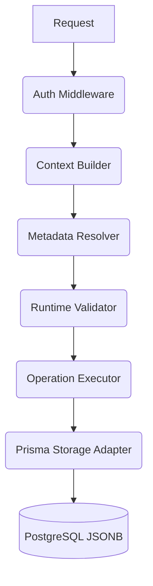

# AI App Generator Backend

A metadata-driven backend runtime that converts JSON configurations into a fully working headless CMS backend, dynamically supporting Database Schema Generation, CRUD APIs, Authentication, Schema Evolution, and Versioning.

## 🚀 Quick Start

### 1. Requirements
- Node.js 20+
- Docker & Docker Compose
- PostgreSQL 15+

### 2. Run with Docker (Recommended)
You can launch the entire stack (Database + API) in one command:
```bash
docker-compose up --build -d
```
The API will be available at `http://localhost:3000`.

### 3. Run Locally (Development)
Ensure you have a PostgreSQL database running, then:

```bash
# 1. Install dependencies
npm install

# 2. Setup Environment Variables
cp .env.example .env
# Set DATABASE_URL and JWT_SECRET in .env

# 3. Apply Schema and Generate Prisma Client
npx prisma generate
npx prisma db push

# 4. Seed Demo Data (CRM & E-Commerce mock apps)
npm run seed:demo

# 5. Start Development Server
npm run dev
```

## 🏗️ Architecture Overview

The system is built on Next.js App Router, TypeScript, and Prisma ORM using a **Dynamic Execution Pipeline**:



### Key Concepts

1. **Metadata Engine:** Accepts JSON Application Definitions (Apps, Entities, Fields), parses them using `zod`, and stores them in relational tables with strict stable IDs and versioning.
2. **Schema Evolution:** Uses AST-style diffing to detect safe vs. breaking changes. Updates are applied surgically (upserts/deprecations) rather than dropping data.
3. **Dynamic Router:** A Next.js catch-all route (`/api/apps/[appId]/[entitySlug]`) acts as a universal transport layer.
4. **Runtime Validator:** Reconstructs Zod schemas on the fly based on the Metadata Engine's current state to sanitize incoming JSON data before storage.
5. **JSONB Storage:** Application records are stored dynamically in PostgreSQL JSONB, isolated securely by `userId` and `appId`.

## 🛡️ Production Hardening
- **Rate Limiting:** IP-based sliding window middleware protects Auth and API routes.
- **Size Limiting:** Hard limits on App Definition size (1MB) and Runtime Records (100KB) prevent OOM exploits.
- **Audit Logging:** Every schema mutation is tracked via `SchemaAuditLog`.
- **Soft Deletes:** Removed fields and entities are marked `deprecatedAt` to prevent data loss.

## 🧪 Example Usage

After running `npm run seed:demo`, log in with:
- **Email:** `demo@buildbot.ai`
- **Password:** `password123`

Retrieve your `accessToken` from the login response.

**Query Dynamic E-Commerce Products:**
```bash
curl -X GET 'http://localhost:3000/api/apps/<E-COM-APP-ID>/product' \
  -H 'Authorization: Bearer <YOUR_ACCESS_TOKEN>'
```

For full documentation, see [docs/api.md](./docs/api.md) and [docs/architecture.md](./docs/architecture.md).
